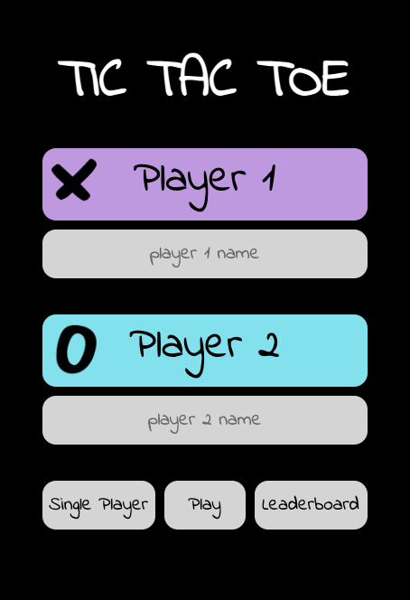
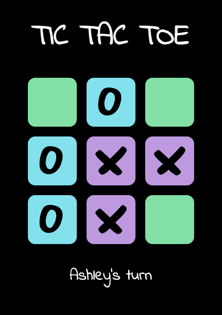
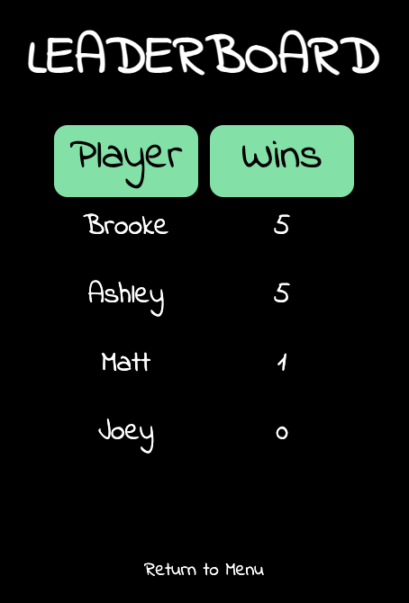
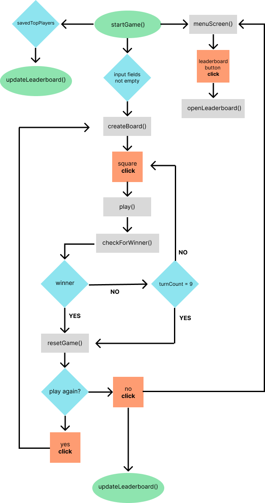

# Tic-Tac-Toe

Your classic tic tac toe game! Player one plays X and player 2 plays O. Each player takes turns placing their marks on a grid of three-by-three squares. If a player gets three marks in a row horizontally, vertically, or diagonally, then that player wins the game!

## Screenshots

| Menu Screen                                                       | Gameboard                                                      | Leaderboard                                                       |
| ----------------------------------------------------------------- | -------------------------------------------------------------- | ----------------------------------------------------------------- |
|  |  |  |

## Technologies Used

- Programming Languages: HTML, CSS, JavaScript
- Developer Tools: VS Code, Git, Google Chrome Dev Tools
- External Resources

  - Wireframing and Flowchart: [Figma](https://www.figma.com)
  - Icons: [flaticon](https://www.flaticon.com/)
  - Fonts: [Google Fonts](https://fonts.google.com/)

## User Stories and Wireframes

[Wireframes](https://bit.ly/3YMTP5y)

### MVP (bronze)

- As a user, I should be able to start a new tic tac toe game
- As a user, I should be able to click on a square to add X first and then O, and so on
- As a user, I should be shown a message after each turn for if I win, lose, tie or who's turn it is next
- As a user, I should not be able to click the same square twice
- As a user, I should be shown a message when I win, lose or tie
- As a user, I should not be able to continue playing once I win, lose, or tie
- As a user, I should be able to play the game again without refreshing the page

### Silver

- As a user, I should be able to input my name
- As a user, I should be able to see my name appear when it is my turn to play
- As a user, I should be able to see my name appear when I win
- As a user, I should be able to click to open up a leaderboard
- As a user, I can see my name and win count on the leaderboard

### Gold

- As a user, I can refresh or exit the page and still see the leaderboard stats when reopening the game
- As a user, I can choose to play in single player mode against the computer

## Approach

### Control Flow



### MVP Functionality

#### Grid Layout

Located inside the `createBoard()` function.

- Created an array of 9 empty strings to hold the game squares
- Looped through the array, creating a div element with an id number for each square
- Give each sqaure an event listener linked to the play function
- Set global variable named playerTurn to equal "cross"

```
playerTurn = "cross"
const gameSquares = ["","","","","","","","",""]
gameSquares.forEach((_square, index) => {
  const gameSqaure = document.createElement("div")
  gameSqaure.id = index
  gameSqaure.classList.add("square")
  gameBoard.appendChild(gameSqaure)
  gameSqaure.addEventListener("click",play)
})
```

#### Winning Conditions

Located inside the `play(e)` function.

- Created an img element with a class name equal to playerTurn (either "cross" or "circle")
- Appended it to the event target (the square that was clicked)
- Switch turns by setting playerTurn variable equal to whatever it currently is not
- Remove event listener from event target (the square that was clicked)
- Increase turn count
- Call `checkForWinner(playerTurn)` function

```
const display = document.createElement("img")
display.classList.add(playerTurn)
display.src = `images/${playerTurn}-black.jpeg`
display.alt = playerTurn
e.target.appendChild(display)
if(playerTurn === "cross"){
  playerTurn = "circle"
} else {
  playerTurn = "cross"
}
e.target.removeEventListener("click", play)
turnCount++
checkForWinner(playerTurn)
```

Located inside the `checkForWinner(playerTurn)` function.

- Grabbed all elements with the square class
- Create an array of all winning combos based on each sqaures id
- Used a boolen to track if a winner is found
- Used the for each method to loop through the winningCombos array, checking if the elements in that array satisfy a specific condition using .every method
  - If the square with every id in the array has a first child element with a cross class, then set winner to true
  - If winner is true then display who wins, remove event listener from all squares, set winnerFound boolean to true
  - If turn count is 9 (every square has been clicked) and winnerFound is false then display it is a tie and remove event listener from all squares

```
const allSquares = document.querySelectorAll(".square")
const winningCombos = [
  [0,1,2], [3,4,5], [6,7,8],
  [0,3,6], [1,4,7], [2,5,8],
  [0,4,8], [2,4,6]
]
let winnerFound = false
winningCombos.forEach(array => {
  let winner = array.every(id => allSquares[id].firstChild?.classList.contains(playerTurn))
  if (winner) {
    gameInfo.innerText = `${winnerName} Wins!!!`
    allSquares.forEach(square => square.removeEventListener("click", play))
    winnerFound = true
    return
    }
})
if(turnCount === 9 && !winnerFound){
  gameInfo.innerText = "It's a tie!"
  allSquares.forEach(square => square.removeEventListener("click", play))
}
```

#### Obstacles

- Determining the best way to look for a tie.
- Figuring out the logic for switching turns.

### Silver Functionality

#### Name Input

Located inside the `startGame()` function.

- After grabbing the form element, an event listener was added to set each players name to the value of each input field
- If both input fields contain a name then the `createBoard()` function is called

```
form.addEventListener("submit", function(event){
  event.preventDefault()
  playerOneObj.name = player1Input.value
  playerTwoObj.name = player2Input.value
  if (playerOneObj.name !== "" && playerTwoObj.name !== ""){
    createBoard()
  }
```

Located inside the `checkForWinner(playerTurn)` function.

- A global `winnerName` variable is set to an empty string
- The variable is then updated based on whose turn it is when the checkForWinner() funciton is called

```
if(playerTurn === "cross"){
  playerTurn = "circle"
  winnerName = playerTwoObj.name
} else {
  playerTurn = "cross"
  winnerName = playerOneObj.name
}
```

#### Leaderboard Logic

Created an empty 2D array that will hold both player names and player win counts
`let playerStats = [[],[]]`
Located inside the `startGame()` function.

- Only push player stats to array if the array does not already contain that player.

```
if (playerOneObj.name !== "" && playerTwoObj.name !== ""){
  createBoard()
  if (!playerStats[0].includes(playerOneObj.name)){
    playerStats[0].push(playerOneObj.name)
    playerStats[1].push(playerOneObj.winCount)
  }
  if (!playerStats[0].includes(playerTwoObj.name)){
    playerStats[0].push(playerTwoObj.name)
    playerStats[1].push(playerTwoObj.winCount)
  }
}
```

Located inside the `checkForWinner(playerTurn)` function.

- Update the win count by getting the index of the winning player's name and incrementing their win count in the playerStats array

```
let playerIndex = playerStats[0].indexOf(winnerName)
  if(winnerName === playerOneObj.name && winnerName !== ""){
    playerStats[1][playerIndex] += 1
  } else if(winnerName === playerTwoObj.name && winnerName !== ""){
    playerStats[1][playerIndex] += 1
  }
```

Located inside the `updateLeaderboard()` function.

- Mapped over the playerStats win count array and saved an array of indices
- Sorted that new array by comparing each players win count
- Created a variable to store the max number of players I wanted to display
- Calculated the minimum value between that number and the length of the playerIndices array
- Created new p tag elements to display each player name and win count

```
let playerIndices = playerStats[1].map((_winCount, index) => index)
playerIndices.sort((a,b)=> playerStats[1][b] - playerStats[1][a])
const topFive = 5
for (let i = 0; i < Math.min(topFive,playerIndices.length); i++){
  const currentIndex = playerIndices[i]
  let playerName = document.createElement("p")
  playerName.classList.add("name")
  columns[0].appendChild(playerName)
  playerName.innerText = playerStats[0][currentIndex]
  let playerWinCount = document.createElement("p")
  playerWinCount.classList.add("win-count")
  columns[1].appendChild(playerWinCount)
  playerWinCount.innerText = playerStats[1][currentIndex]
}
```

##### Obstacles

- Deciding on how I wanted to save player name input and win count data
- Displaying the leaderboard stats in correct columns
- Figuring out the logic for displaying only new player stats and updating player's stats that played previously

### Gold Functionality

#### Local Storage Logic

Located in `updateLeaderboard()` function.

- Saved the playerStats array to the browser's local storage

```
localStorage.setItem("topPlayers",JSON.stringify(playerStats))
```

Located in the `startGame()` function.

- Retrieve top players from localStorage

* Update the leaderboard with the parsed JSON data

```
const savedTopPlayers = localStorage.getItem("topPlayers")
if(savedTopPlayers){
  const parsedTopPlayers = JSON.parse(savedTopPlayers)
  playerStats = parsedTopPlayers
  updateLeaderboard()
}
```

## Acknowledgments

## Future Steps

- AI integration
